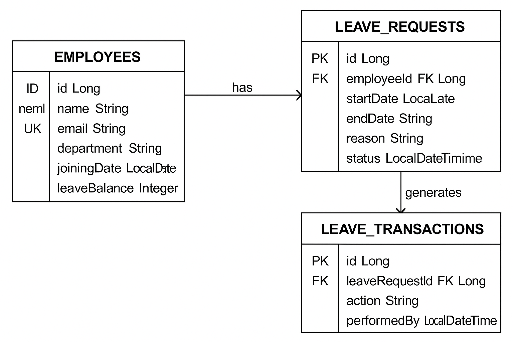
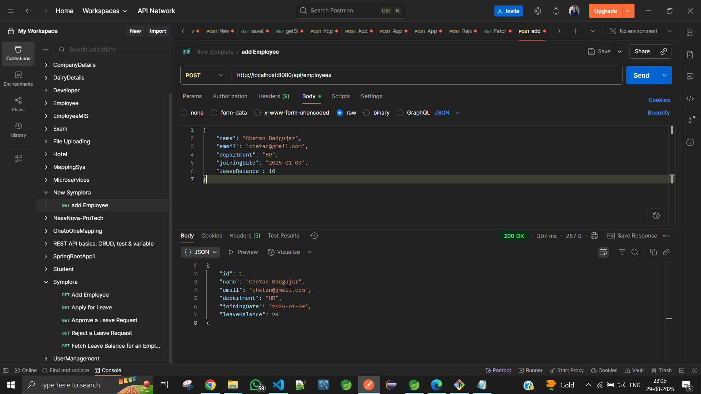
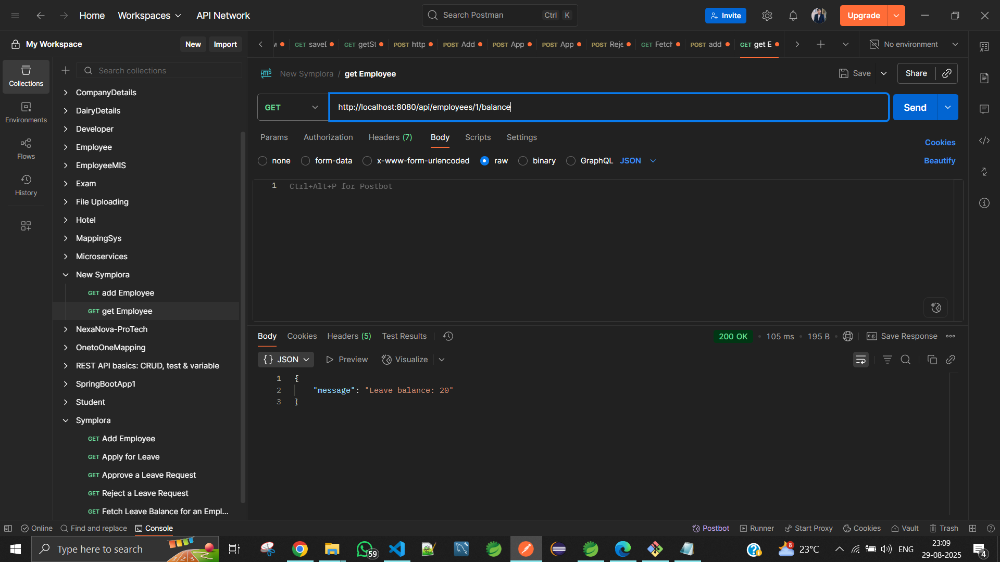
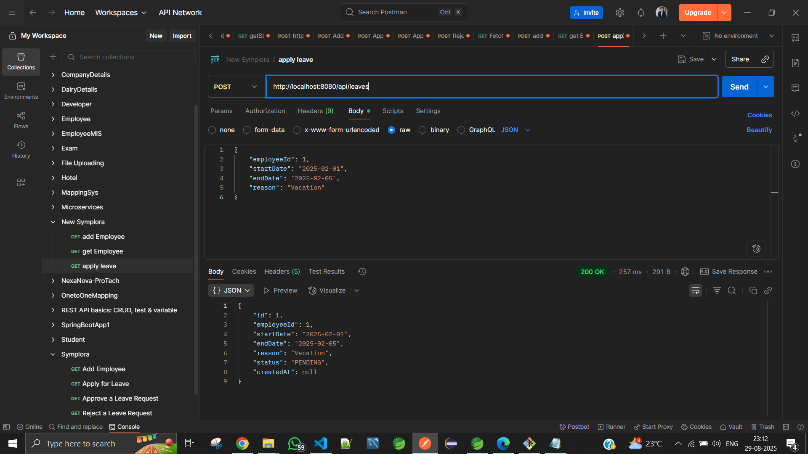

# Mini-Leave-Management-System

## Overview
This project is a **Leave Management System** built using **Spring Boot**, **MySQL**, and **JPA**.  
It manages employees, leave requests, and leave transactions with REST APIs, database design, and deployment-ready configurations.

---

## Setup Steps
```
git clone https://github.com/ChetanBadgujar5522/Mini-Leave-Management-System.git
```
---

## Part 1 — Data Modelling

### ER Diagram


---

## Database Design

### 1) Employees Table

| Column        | Type      | Constraints                       |
|---------------|-----------|-----------------------------------|
| id            | BIGINT     | Primary Key (Auto Increment)       |
| name          | VARCHAR    | NOT NULL                          |
| email         | VARCHAR    | UNIQUE, NOT NULL                  |
| department    | VARCHAR    | NULL                              |
| joining_date  | DATE       | NULL                              |
| leave_balance | INT        | Default 0                         |

**Indexes:**
- `idx_employee_email` on **email** for faster lookups  

---

### 2) Leave Requests Table

| Column        | Type        | Constraints                                    |
|---------------|-------------|-----------------------------------------------|
| id            | BIGINT       | Primary Key                                   |
| employee_id    | BIGINT       | Foreign Key → employees(id)                  |
| start_date     | DATE         | NOT NULL                                     |
| end_date       | DATE         | NOT NULL                                     |
| reason         | VARCHAR(500) | NULL                                          |
| status         | ENUM         | PENDING, APPROVED, REJECTED                   |
| created_at     | DATETIME     | Auto Timestamp                                |

**Indexes:**
- `idx_leave_employee` on **employee_id**  

---

### 3) Leave Transactions Table

| Column            | Type           | Constraints                                         |
|-------------------|----------------|---------------------------------------------------|
| id                | BIGINT         | Primary Key                                        |
| leave_request_id   | BIGINT         | Foreign Key → leave_requests(id)                   |
| action            | VARCHAR        | e.g., APPROVE, REJECT                               |
| performed_by       | VARCHAR        | Admin/Manager Email                                 |
| timestamp          | DATETIME       | Auto Timestamp                                      |
| comment            | VARCHAR(1000)  | NULL                                               |

---

## Part 2 — Low Level System Design

## API Contracts

The base URL is `http://localhost:8080`

### 1) Create Employee
**Endpoint:**  
`POST /api/employees`

**Request:**
```json
{
  "name": "Chetan Badgujar",
  "email": "chetan@gmail.com",
  "department": "HR",
  "joiningDate": "2025-01-09",
  "leaveBalance": 10
}
```
**Success Response (200 OK):**
```json
{
  "id": 1,
  "name": "Chetan Badgujar",
  "email": "chetan@gmail.com",
  "department": "HR",
  "joiningDate": "2025-01-09",
  "leaveBalance": 20
}
```



### 2) Apply Leave
**Endpoint:**  
`POST /api/leaves`

**Request:**
```json
{
  "employeeId": 1,
  "startDate": "2025-02-01",
  "endDate": "2025-02-05",
  "reason": "Vacation"
}
```
**Success Response (200 OK):**
```json
{
    "id": 1,
    "employeeId": 1,
    "startDate": "2025-02-01",
    "endDate": "2025-02-05",
    "reason": "Vacation",
    "status": "PENDING",
    "createdAt": null
}
```


### 3) Approve/Reject Leave
**Endpoint:**  
`PUT /api/leaves/{id}/approve`

**Request:**
```json
{
  "performedBy": "admin@abc.com",
  "comment": "Approved for vacation"
}
```
**Success Response (200 OK):**
```json
{
  "leaveId": 101,
  "status": "APPROVED"
}
```

## Class / Module Design

### Project Package Structure:

```
com.symplora
│
├── controller
│   ├── EmployeeController.java
│   ├── LeaveController.java
│
├── service
│   ├── EmployeeService.java
│   ├── LeaveService.java
│
├── repository
│   ├── EmployeeRepository.java
│   ├── LeaveRequestRepository.java
│   ├── LeaveTransactionRepository.java
│
├── model
│   ├── Employee.java
│   ├── LeaveRequest.java
│   ├── LeaveTransaction.java
│
├── dto
│ ├── ApplyLeaveRequestDto.java
│ ├── EmployeeCreateDto.java
│ ├── SimpleResponseDto.java
│
├── exception
│ ├── ApiException.java
│ ├── BadRequestException.java
│ ├── NotFoundException.java
```
### Pseudocode: Leave Approval Logic

```pseudo
function approveLeave(leaveId, performedBy, comment):
    leave = findLeaveById(leaveId)
    if leave.status != PENDING:
        return "Leave already processed"

    leave.status = APPROVED
    saveLeave(leave)

    transaction = new LeaveTransaction(
        leaveId, "APPROVED", performedBy, comment
    )
    saveTransaction(transaction)

    updateEmployeeLeaveBalance(leave.employeeId, leave.days)
    return "Leave Approved"
```

### Assumptions
```
*   One employee can have multiple leave requests
*   Leave balance is decremented only on approval
*   Admin approves or rejects leave
```

### Edge Cases

1. **Invalid Employee ID**  
   - If a leave request is submitted for a non-existing employee ID, return a `404 NOT FOUND` error.

2. **Leave Dates Overlap**  
   - If a leave request overlaps with another **approved** leave, reject it with a `400 BAD REQUEST`.

3. **Leave Balance Exceeded**  
   - If requested leave days exceed the employee's leave balance, reject the request.

4. **Past Dates in Leave Request**  
   - If start or end date is in the past, reject the request with a validation error.

5. **End Date Before Start Date**  
   - If end date is before start date, reject the request.

6. **Duplicate Leave Requests**  
   - If a leave request with the same date range already exists in **PENDING** status, reject it.

7. **Concurrent Approvals**  
   - If two admins try to approve the same leave request at the same time, only the first approval should succeed.

8. **Database Connection Failure**  
   - If DB is down, return a `503 SERVICE UNAVAILABLE` error with a prop

```

### Potential Improvements
```
*   Add JWT authentication
*   Email notifications on leave approval
*   Role-based access control (Admin, Employee)
*   Pagination for leave history
```
